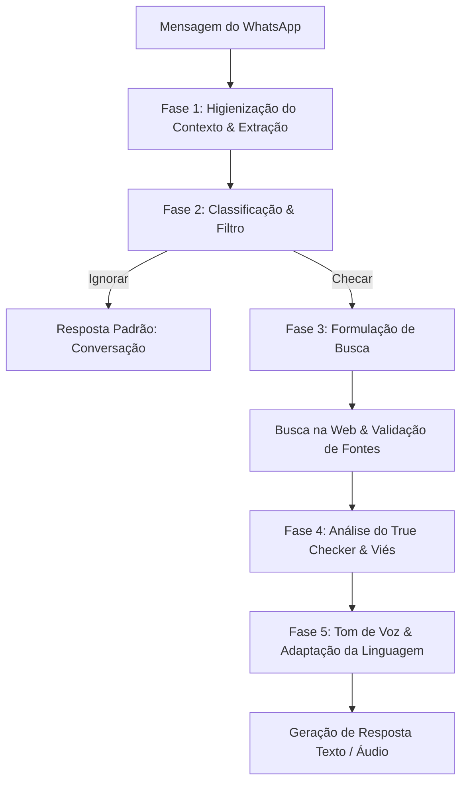

# Pipeline do LLM — e-verdade

Este documento especifica a arquitetura e as fases de processamento do pipeline do modelo de linguagem (LLM) no sistema **e-verdade**, detalhando desde a recepção da mensagem até a geração da resposta personalizada.

---

## Fluxo do Processamento (Pipeline)

---

## Detalhamento das Fases

### Fase 1: Higienização do Contexto (Context Sanitization) e Extração
*   **Objetivo:** Limpar e resetar o histórico de contexto/memória da sessão do agente a cada execução para garantir que interações anteriores não enviesem a checagem atual. Adicionalmente, isolar o núcleo da mensagem.
*   **Ações:**
    *   **Higienização do Contexto:** Esvaziar buffers de memória ou contextos acumulados de sessões passadas. Cada nova verificação factual deve começar de um estado "limpo" (clean state), prevenindo a contaminação factual ou ideológica entre diferentes usuários ou execuções.
    *   **Limpeza e Extração:** Remover emojis repetidos, formatações excessivas e marcadores de correntes de encaminhamento (ex: *"URGENTE"*, *"REPASSEM DIRETO DO GRUPO"*), isolando o texto/alegação central.

### Fase 2: Classificação e Filtro
*   **Objetivo:** Identificar se a mensagem contém uma alegação factual verificável.
*   **Ações:**
    *   Classificar em: **Factual Verificável** (ex: notícias políticas, alertas de saúde, economia) ou **Não-factual/Opinião** (perguntas de conversa diária, saudações, piadas).
    *   Se não for verificável, desviar para um fluxo de conversação amigável padrão sem acionar ferramentas de busca.

### Fase 3: Formulação de Busca (Fact-Checking Query)
*   **Objetivo:** Construir uma consulta neutra e otimizada para os motores de busca.
*   **Ações:**
    *   O LLM traduz a alegação higienizada em termos de busca focados em fatos (ex: *"vacina da gripe causa X"* -> *"vacina gripe efeitos colaterais comprovados"*).
    *   Adicionar restrições de busca aos sites definidos como confiáveis (ver [search_and_verification.md](file:///home/oihugub/e-verdade/docs/search_and_verification.md)).

### Fase 4: Análise de Veracidade e Viés (True Checker)
*   **Objetivo:** Analisar os resultados de busca e avaliar o viés da alegação original.
*   **Ações:**
    *   **True Checker:** Comparar a alegação inicial com os trechos extraídos das fontes confiáveis. Determinar o status da notícia: `FATO`, `FAKE` ou `IMPRECISO/MISTO`.
    *   **Análise de Viés:** Identificar se a mensagem original possui termos com forte viés político ou ideológico para que a resposta possa neutralizar esse tom e focar estritamente em dados factuais (crucial para o perfil de usuários como o *João*).
    *   **Timestamp Check:** Validar se a notícia, embora factual, refere-se a um evento antigo que está sendo compartilhado fora de contexto como se fosse recente.

### Fase 5: Tom de Voz e Adaptação da Linguagem
*   **Objetivo:** Customizar a linguagem de resposta conforme o perfil do usuário ou características gerais de usabilidade amigável.
*   **Diretrizes de Tom:**
    1.  **Linguagem Amigável:** Evitar arrogância acadêmica. Explicar o porquê de forma simples.
    2.  **Neutralidade:** Não tomar partido político, focar nos fatos e em fontes qualificadas.
    3.  **Acessibilidade:** Preparar uma versão da mensagem formatada para leitura fácil (bullet points curtos) e uma estrutura textual otimizada para o motor de **Text-to-Speech** (áudio), removendo URLs e caracteres especiais que soam estranhos ao serem lidos.
