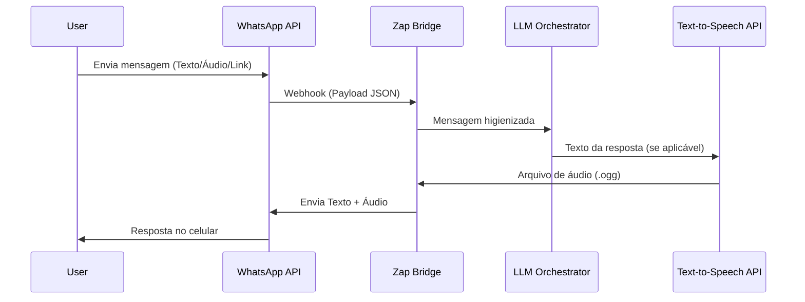

# Integração com WhatsApp (Zap Bridge) — e-verdade

Este documento especifica a infraestrutura de conexão com o WhatsApp, detalhando o funcionamento do webhook (Zap bridge), a geração de áudios (Text-to-Speech) e as políticas de controle de envio.

---

## 1. Arquitetura do Zap Bridge

Para interagir com os usuários no WhatsApp, o e-verdade utilizará uma camada de integração (bridge) conectada a uma API de mensageria.

### Funcionalidades do Bridge:
*   **Recebimento de Mensagens (Inbound Webhook):** Escuta mensagens enviadas ao número do bot. Identifica o número do remetente (para controle de uso e personalização) e o tipo de mídia (texto, link, imagem ou áudio).
*   **Transcrição de Áudio de Entrada (Speech-to-Text):** Se o usuário enviar uma dúvida por áudio, o bridge encaminha para um serviço de transcrição (ex: Whisper API) antes de rodar o pipeline do LLM.

---

## 2. Text-to-Speech (Txt to S) para Acessibilidade

Para incluir e engajar usuários com dificuldades de leitura ou idosos (como a persona **Maria**), o sistema oferecerá respostas em formato de áudio nativo do WhatsApp.

### Especificações do Txt to S:
*   **Formato de Saída:** O áudio deve ser enviado como uma mensagem de voz gravada no WhatsApp (formato `.ogg` com codec OPUS), para que apareça com o microfone azul, facilitando a reprodução direta.
*   **Processamento do Texto para Fala:**
    *   O LLM gerará um roteiro curto otimizado para fala (sem URLs longas, sem emojis difíceis e em linguagem calorosa e respeitosa).
    *   **Exemplo:** Em vez de ler *"FALSO link ponto com barra vacinas"*, o áudio dirá *"Isso é falso e não há registro oficial sobre essa vacina"*.
*   **Serviços recomendados:** ElevenLabs, Google Cloud Text-to-Speech ou OpenAI TTS.

---

## 3. Limite de Uso e Controle ("5 total")

Para mitigar spam, controlar custos de APIs (LLM e TTS) e manter a estabilidade do servidor, o sistema implementará limites de uso:

*   **Limite Diário por Usuário:** Máximo de **5 consultas por dia** por número de telefone.
*   **Controle de Transmissão:** O bot processará apenas mensagens enviadas diretamente a ele (mensagens em grupos só serão respondidas se o bot for mencionado diretamente ou se configurado especificamente para isso, evitando loops de conversas).
